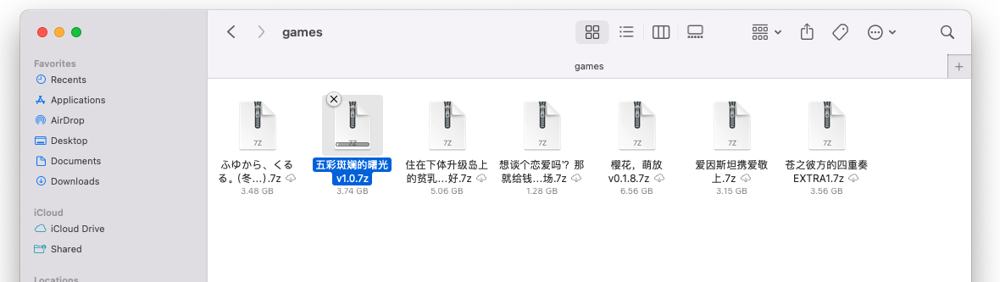
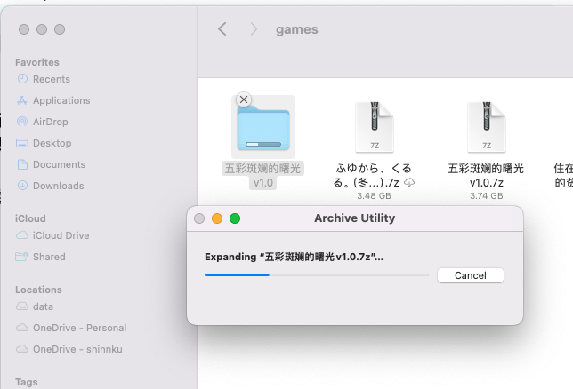
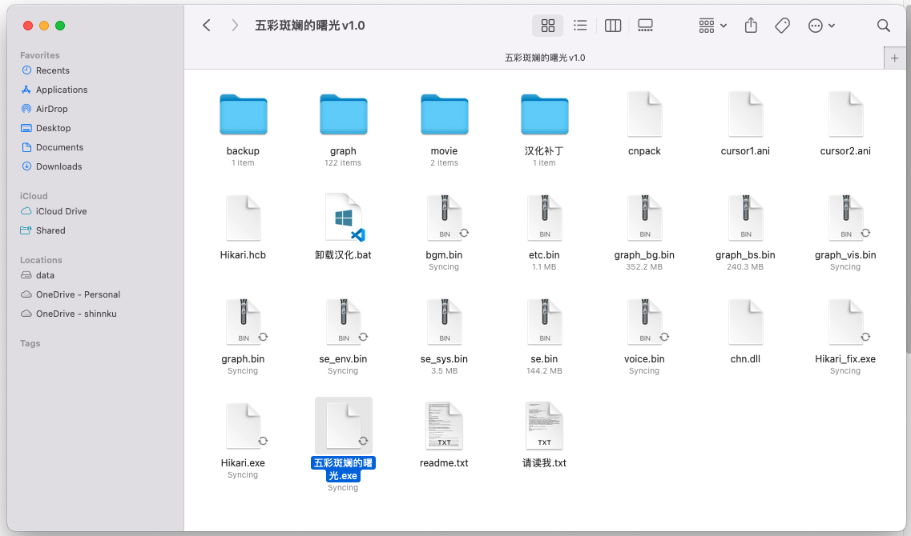

# 如何打开galgame

本网站上面的所有内容呈现方式:

## Windows部分

均为7zip压缩包呈现, 请先完全解压之后再打开其中的**可执行**文件. 

> (请忽略来自macos设备的截图, windows完全一致)
> 下图为解压中的进度条.

如果不知道如何解压 `.7z` 文件, 请下载 p7zip, 网站的 **工具(Tools)** 内有, 名字叫做 `7zip-x64.exe` 并安装.

解压完成后, 里面会有可执行文件, `.exe` 结尾的, 一般有几个, 其中一个点开之后是日文原版的galgame, 还有一个约定俗成命名的 `name**_chs.exe`, 点开应该就能开启汉化了.

如果你不知道什么是文件后缀, 并且完全看不见什么7z, exe, 不明白本文在说什么, 可能是电脑没有**开启自动显示文件后缀**, 请百度或者google搜索前面加粗部分

## 安卓手机

待完成?

